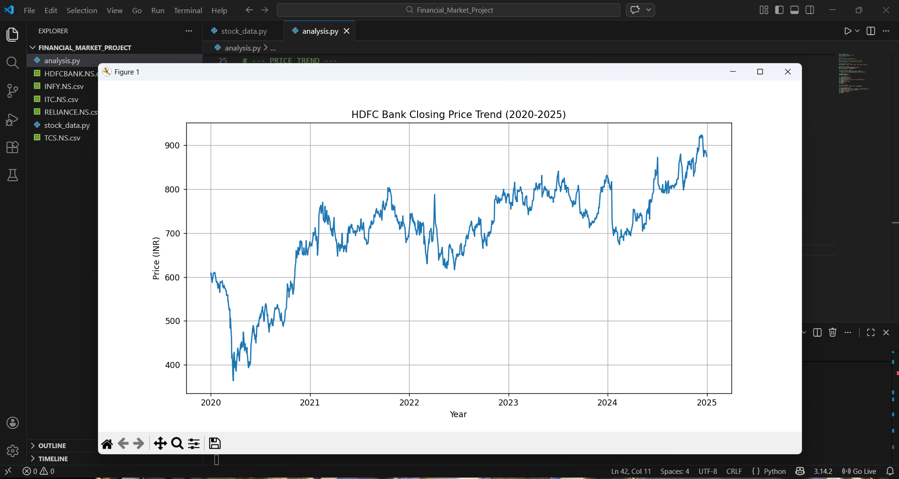
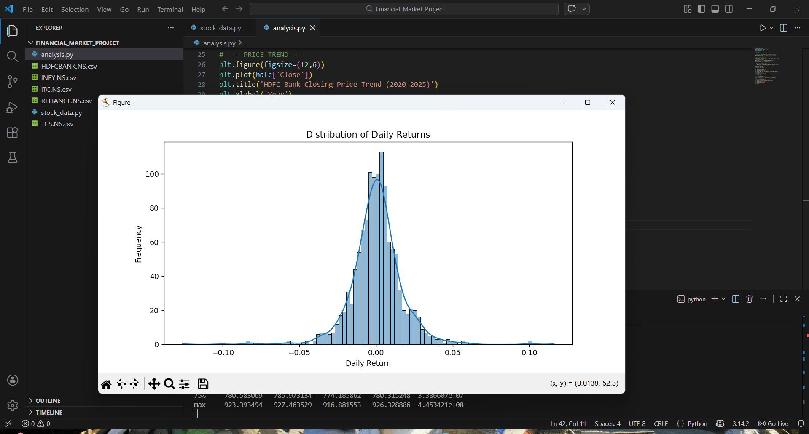
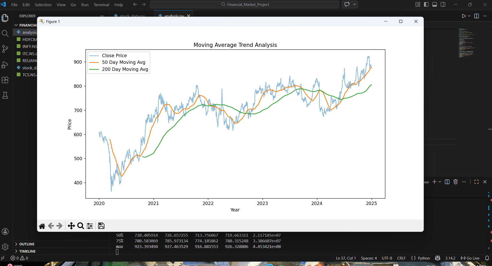
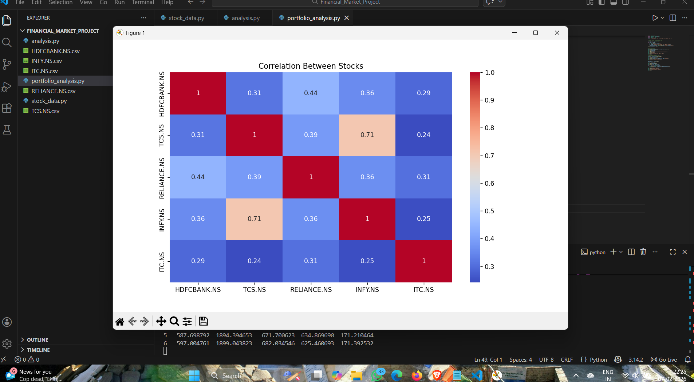
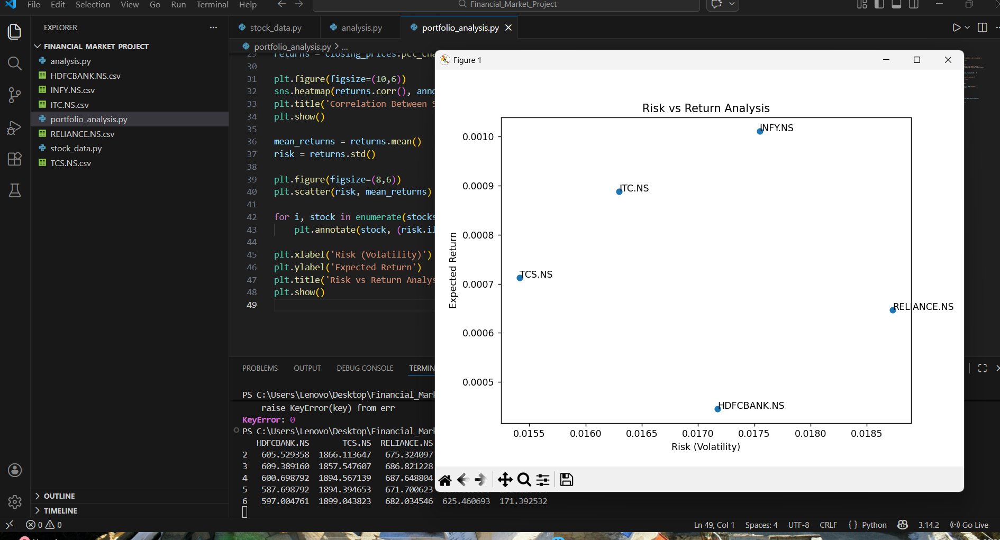
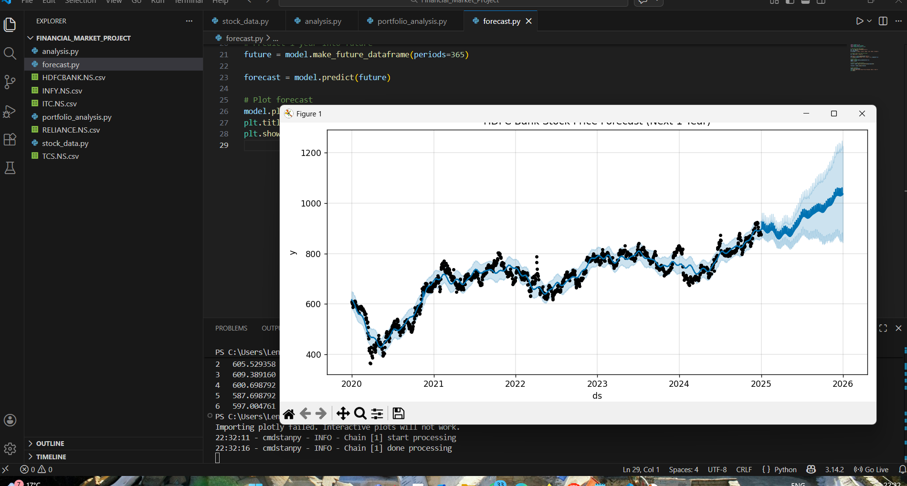
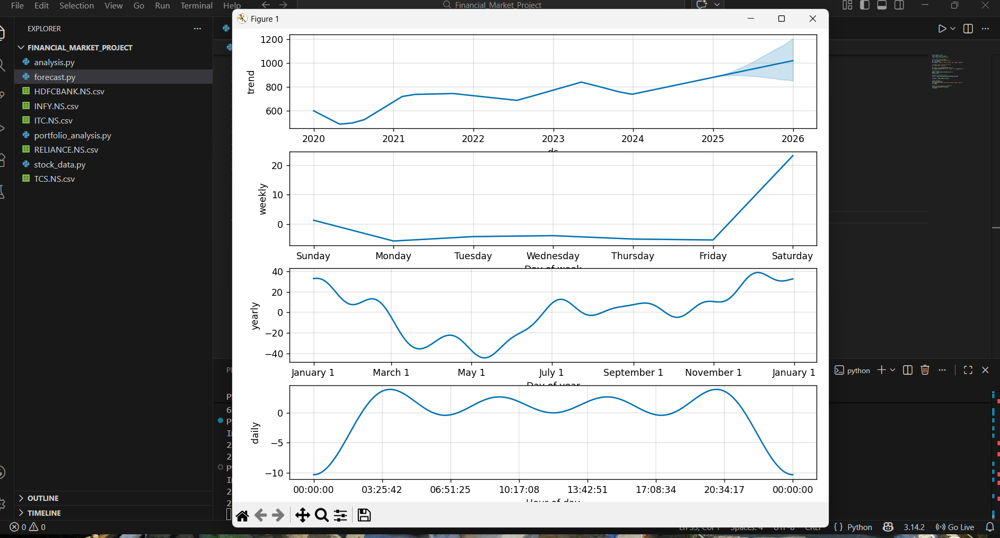
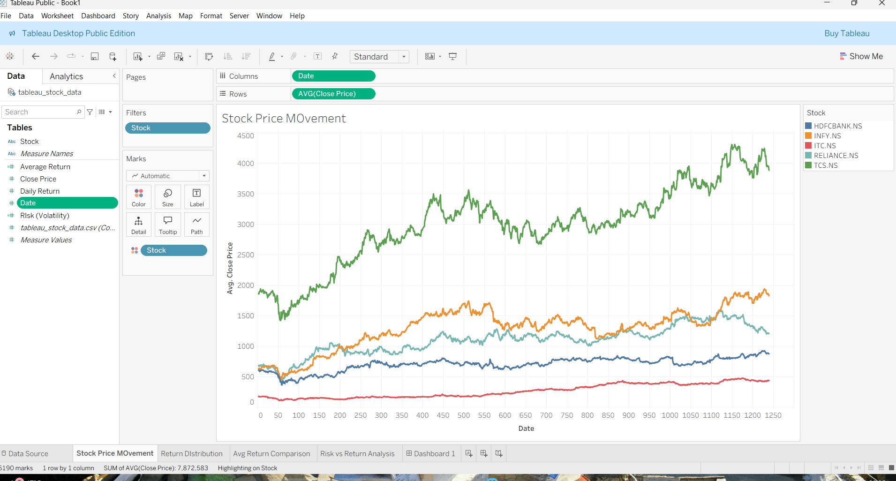

# Financial Market Analysis & Price Forecasting

## Live Interactive Dashboard
Tableau Public Link:
(PASTE YOUR TABLEAU PUBLIC LINK HERE)

---

## Project Overview
This project analyzes historical stock market data to understand market behavior, compare company performance, and forecast future stock prices using time-series techniques.

The goal is to transform raw financial data into meaningful insights that can support investment decision-making.

---

## Technologies Used
- Python
- Pandas
- NumPy
- Matplotlib
- Seaborn
- Prophet (Time Series Forecasting)
- Tableau (Interactive Visualization)

---

## Analysis Performed
The following financial analytics were conducted:

- Stock price trend analysis
- Daily returns distribution
- Moving average comparison (50-day & 200-day)
- Multi-stock performance comparison
- Correlation analysis between companies
- Risk vs return evaluation
- Time-series forecasting
- Seasonal decomposition analysis

---

## Key Learnings
This project demonstrates:
- Time series analysis
- Financial data interpretation
- Data visualization
- Forecasting methods
- Analytical reasoning

---

## Important Note
The dataset and full source code are intentionally not included to prevent unauthorized academic or commercial reuse.  
This repository is provided strictly for portfolio evaluation and project demonstration.

---

## Analysis Visualizations

### Stock Price Trend

### Daily Returns Distribution

### Moving Average Analysis

### Portfolio Performance Comparison

### Correlation Heatmap

### Risk vs Return

### Price Forecast

### Seasonality Analysis

### Tableau Dashboard Preview

